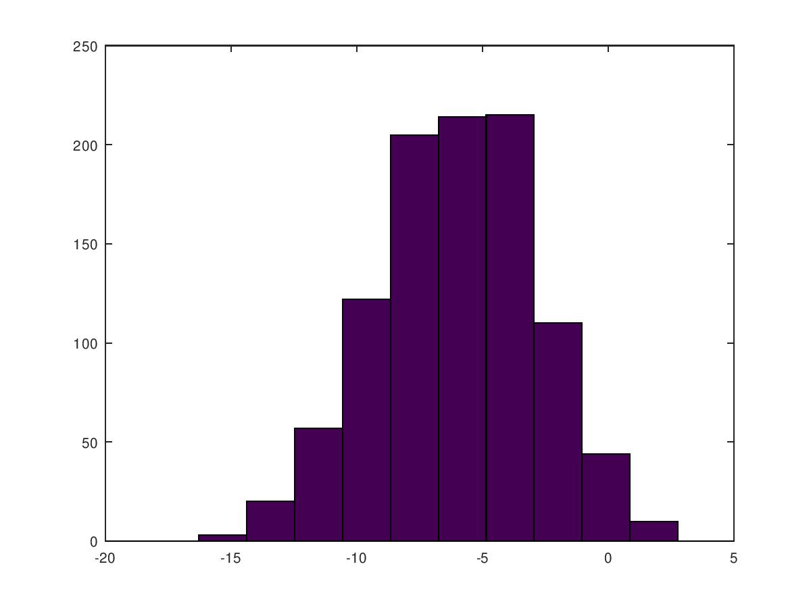

```{r setup, include=FALSE}
# Settings
knitr::opts_chunk$set(echo = TRUE, cache = TRUE,
                      engine.path = 'C:/Octave/Octave-5.2.0/mingw64/bin/octave-cli.exe')
```

```{octave}
% basic operations
1+2
2-1
2*2
2/2

% comparations
1==0    %true
1~=2    %false

% assign var
a = 3
b = 1
a + b

% format
a = pi
disp(a)
disp(sprintf('2 decimals: %0.2f', a))
disp(sprintf('6 decimals: %0.6f', a))
```

```{octave}
% matix
A = [1 2; 3 4; 5 6]
B = [2 3 4; 6 7 8]
v = [1 2 3]
v = 1:6

% other notations
ones(2,3)
w = zeros(1,3)

% Random
rand(3,3)
W = rand(1,3)

% identity
I = eye(4)

% operations
c = 2*ones(2,3)
size(A)
length(v)

```

```{octave}
% random and normal
w = -6 + sqrt(10)*(randn(1,1000));
hist(w)

print -djpg figure1.jpg
```



