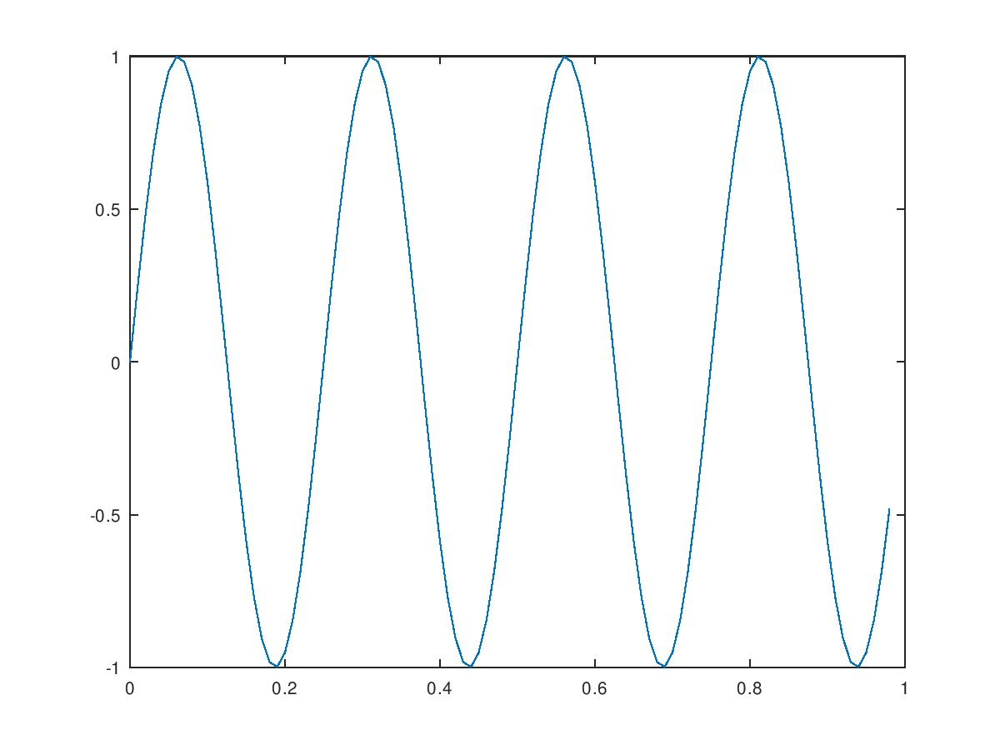
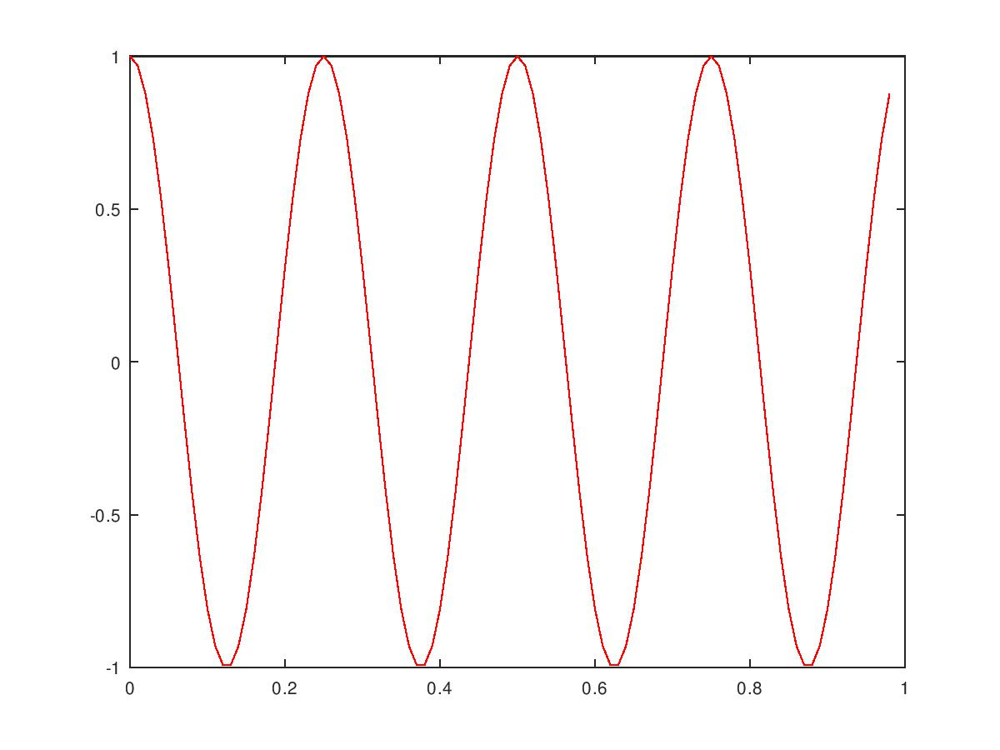
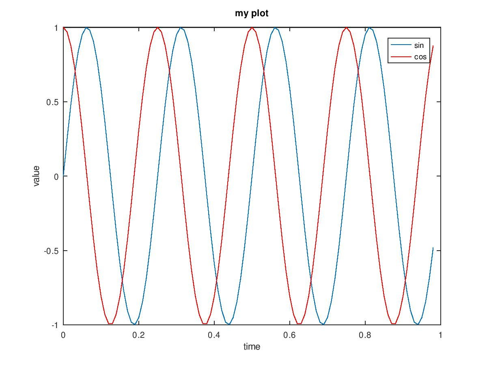
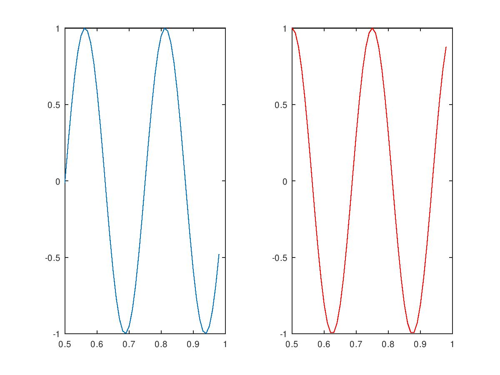
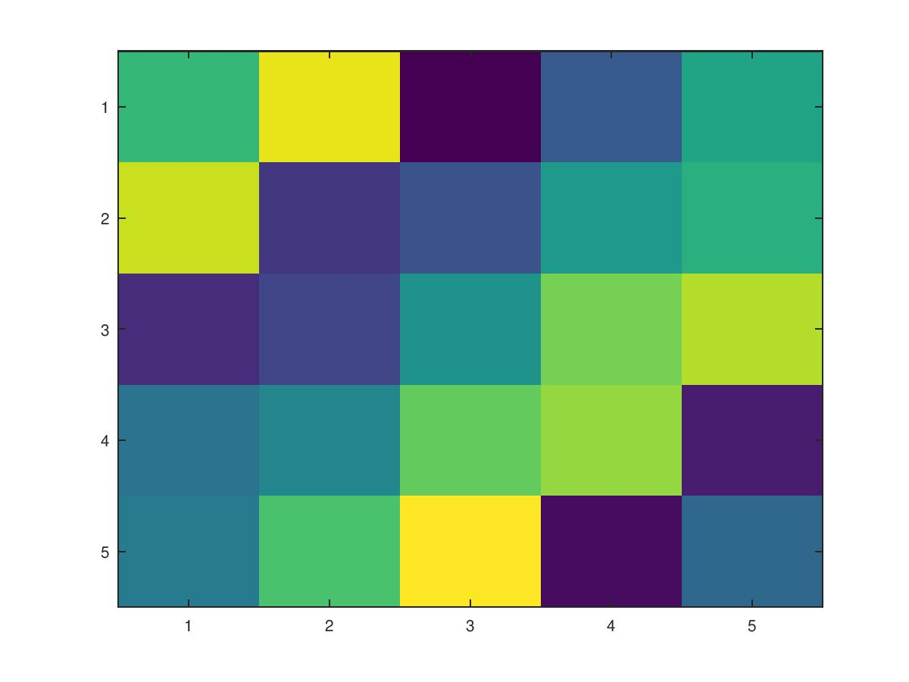

```{r setup, include=FALSE}
# Settings
knitr::opts_chunk$set(echo = TRUE, cache = TRUE,
                      engine.path = 'C:/Octave/Octave-5.2.0/mingw64/bin/octave-cli.exe')
```

```{octave}
%# basic operations
1+2
2-1
2*2
2/2

%# comparations
1==0    %#true
1~=2    %#false

% assign var
a = 3
b = 1
a + b

%# format
a = pi
disp(a)
disp(sprintf('2 decimals: %0.2f', a))
disp(sprintf('6 decimals: %0.6f', a))
```

```{octave}
%# matix
A = [1 2; 3 4; 5 6]
size(A)
B = [2 3 4; 6 7 8]
v = [1 2 3]
v = 1:6
length(v)

%# other notations
ones(2,3)
c = 2*ones(2,3)
w = zeros(1,3)

%# Random
rand(3,3)
W = rand(1,3)

%# identity
I = eye(4)
```

```{octave}
%# random and normal
w = -6 + sqrt(10)*(randn(1,1000));
hist(w)

print -djpg figure1.jpg
```


```{octave}
%# Matrix operations 1

A = [1 2; 3 4; 5 6]
A(2,2)
A(2,:)
A(:,2)
A([1 3],:)
A(:,2) = [10, 11, 12]
A = [A, [100; 101; 102]]
```

```{octave}
%# Matrix operations 2

A = [1 2; 3 4; 5 6]
B = [11 12; 13 14; 15 16]
C = [A B]
C = [A; B]
```

```{octave}
%# Load data

load featuresX.dat
load priceY.dat

who
size(featuresX)
size(priceY)

save task1.m;

clear featuresX
clear priceY
clear            %# Clear all variables
```

```{octave}
%# Load project

load task1.m
size(featuresX)

D = [priceY featuresX];
save dataset.dat D
```

```{octave}
%# Matrix operations 3

A = [1 2; 3 4; 5 6]
B = [11 12; 13 14; 15 16]
C = [1 1; 2 2]
v = [1; 2; 3]
A*C
A.*B   %# multiply by the correspondent element of B
A .^2
1 ./ v  %# reciprocal of v
v + ones(length(v),1)
v + 1
```

```{octave}
%# Matrix operations 4

A = [1 2; 3 4; 5 6]
A'
(A')'
```

```{octave}
%# Matrix operations 5

a = [1 15 2 0.5]
A = [1 2; 3 4; 5 6]
val = max(a)
max(A)
[val, ind] = max(a)
a < 3      %# Evaluate < 3
sum(a)
```

```{octave}
%# Matrix operations 6

A = magic(3)           %# Magic refers to every column and row sums the same 
max(A, [], 1)
max(A, [], 2)
max(A), max(max(A)), max(A(:))
sum(A, 1)
sum(A, 2)
sum(sum(A .* eye(length(max(A)))))   %# Sum of the diagonal
sum(sum(A .* flipud(eye(length(max(A))))))
pinv(A)    % Inverse
A * pinv(A)
```

```{octave}
%# Ploting data

t = [0:0.01:0.98];

y1 = sin(2*pi*4*t);
plot(t, y1)
print -djpg figure2.jpg

y2 = cos(2*pi*4*t);
plot(t, y2, 'r')            %# color red
print -djpg figure3.jpg

plot(t, y1);
hold on;
plot(t, y2, 'r')
xlabel('time')
ylabel('value')
legend('sin', 'cos')
title('my plot')
print -djpg figure4.png

%# multiple plotting
subplot(1,2,1);
plot(t, y1);
axis([0.5 1 -1 1])
subplot(1,2,2);
plot(t, y2, 'r');
axis([0.5 1 -1 1])
print -djpg figure5.png

```





```{octave}
clf;
A = magic(5);
imagesc(A)
print -djpg figure6.png
```


```{octave}
%# While if statements

v = zeros(10,1);
for i=1:10
  v(i) = 2^i;
end;
v

indices = 1:10;
for i=indices,
  disp(i);
end;

i = 1;
while i <= 5,
  v(i) = 100;
  i = i+1;
end;
v

i = 1
while true,
  v(i) = 999;
  i = i+1;
  if i == 6;
    break;
  end;
end;
v

v(1) = 2
if v(1) == 1,
  disp('the value is one');
elseif v(1) == 2,
  disp('the value is two');
else
  disp('the value is not one or two');
end;
```

```{octave}
%# Functions stored

squareThisNumber(5)     %# Should exist archive.m of the function in the WD
[a,b] = squareAndCubeThisNumber(5)
```

```{octave}
%# Cost function

X = [1 1; 1 2; 1 3]
Y = [1; 2; 3]
theta = [0;1];

J = costFunctionJ(X,Y,theta)

theta = [0; 0]
J = costFunctionJ(X,Y,theta)
```

